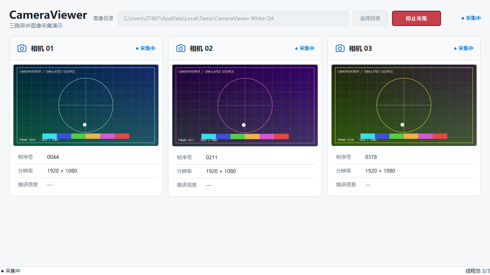

# CameraViewer

一个按 [PRD](docs/PRD.md) 实现的 PySide2 桌面 Demo。它使用本地 JPEG 序列模拟三台独立相机，通过 View 驱动的异步逐帧 Pull 展示线程隔离、启停作废和异常恢复逻辑。



## 功能概览

- 三个等宽相机面板，共用图像目录，分别从第 1、168、335 帧开始循环。
- 全局启动与停止；停止后保留最后一张成功图像。
- 每路最多一个在途任务和一个合并后的待提交请求。
- `QThreadPool` 最多三个线程，读取、解码和颜色转换均在 Worker 中执行。
- 成功帧绘制完成后由 View 请求下一帧；失败结果显示后继续请求。
- 启停代次隔离，迟到结果不会显示，也不会推进游标。
- 支持中文、空格和非 ASCII 图像路径。

## 环境

- Python 3.9
- PySide2 5.15.2.1
- OpenCV 4.10
- NumPy 1.26

建议使用独立虚拟环境：

```powershell
py -3.9 -m venv .venv
.\.venv\Scripts\Activate.ps1
python -m pip install -r requirements-dev.txt
```

## 快速演示

先生成 PRD 要求的 500 张 1920×1080 图像：

```powershell
python scripts/generate_frames.py sample_frames
```

启动应用：

```powershell
python -m cameraviewer --image-dir sample_frames
```

也可以不传 `--image-dir`，在界面中选择目录。

## 自动化测试

```powershell
pytest
```

测试默认启用严格警告模式，覆盖 Unicode 路径、序列完整性、游标推进、连续失败、
50 次启停和“停止后立即重启”的迟到结果隔离。

## 代码结构

```text
cameraviewer/
├── app.py          # 命令行入口和 QApplication
├── main_window.py  # 窗口组合与信号连接
├── controls.py     # 全局工具栏和状态栏
├── widgets.py      # 相机面板和绘制后 Pull
├── capture.py      # 全局协调器、单路调度器和后台任务
├── source.py       # 可替换数据源接口和本地图像序列
└── models.py       # 单路/全局状态与帧结果模型
scripts/
└── generate_frames.py
tests/
```

`CaptureCoordinator` 统一管理线程池和三路控制器；控制器只依赖 `FrameSource`
接口。替换为真实相机或 RPC 时，界面和调度流程无需改动。
