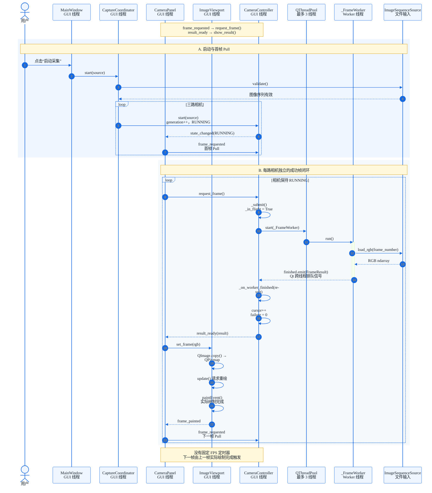

# CameraViewer：View 驱动的 Pull 模型

> **核心结论：** 首帧由 `CameraPanel` 进入 `RUNNING` 时请求；后续成功帧由 `ImageViewport.paintEvent()` 实际绘制完成后请求。整个采集循环不依赖固定定时器。

## 一图读懂主成功流程

## 如何读这张图

1. `MainWindow.start_all()` 创建数据源，交给 `CaptureCoordinator` 验证并启动三路控制器。
2. `CameraPanel.apply_state()` 收到 `RUNNING`，发出首帧 `frame_requested`。
3. `CameraController` 只提交一个 `_FrameWorker`，Worker 在线程池读取并处理一帧。
4. `FrameResult` 通过 Qt Signal 回到 GUI 线程，由 `CameraPanel` 交给 `ImageViewport`。
5. `ImageViewport.paintEvent()` 完成实际绘制，再触发下一帧 Pull，形成闭环。

## Pull 模型的 3 个关键点

| 关键点 | 说明 | 对应代码 |
| --- | --- | --- |
| View 决定何时继续 | Controller 不主动连续取帧；首帧和下一帧请求都来自 View | `CameraPanel.apply_state()`、`ImageViewport.paintEvent()` |
| 一次只处理一帧 | 每路最多一个在途 Worker；不会形成帧队列 | `CameraController.request_frame()`、`_submit()` |
| 绘制完成才继续 | `set_frame()` 只请求重绘；真正的下一次 Pull 来自 `paintEvent()` | `ImageViewport.set_frame()`、`paintEvent()` |

这使系统天然具备背压：如果读取或绘制变慢，下一次请求也会自然变慢，不会无限预取或积压帧。

## 主要异常与边界场景

异常逻辑不放在主时序图中，处理规则如下：

| 场景 | 处理方式 |
| --- | --- |
| 目录不存在或 500 帧序列不完整 | `CaptureCoordinator.start()` 捕获验证异常并将三路 Controller 设为 `ERROR`，不发起首帧 Pull。 |
| 已有在途 Worker 时再次收到请求 | 不重复创建 Worker，只设置 `_pending=True`；多个重复请求合并为一个待处理请求。 |
| 单帧读取、解码或处理失败 | 失败结果仍推进 cursor；界面显示错误并保留上一张成功图像，然后立即 Pull 下一帧，不等待绘制。 |
| 连续 500 帧失败 | 仅对应 Controller 进入 `ERROR`，该路停止 Pull，其他两路继续。 |
| 采集中点击停止 | `stop()` 增加 generation、清除 pending 并进入 `STOPPED`；最后一张成功图像保留。 |
| Worker 在停止后迟到返回 | generation 不匹配，结果不显示且 cursor 不推进。 |
| 停止后立即重启，旧 Worker 尚未结束 | 新请求保存为 pending；旧结果结算并被丢弃后，提交新 generation 的 Worker。 |
| 普通窗口重绘 | 不触发 Pull。只有 `set_frame()` 设置的新帧标志会让 `paintEvent()` 发出一次 `frame_painted`。 |

## 核心代码入口

| 职责 | 类与方法 | 文件 |
| --- | --- | --- |
| 全局启动/停止 | `MainWindow.start_all()` / `stop_all()` | [`main_window.py`](../cameraviewer/main_window.py) |
| 数据源验证与三路协调 | `CaptureCoordinator.start()` / `stop()` | [`capture.py`](../cameraviewer/capture.py) |
| 首帧请求 | `CameraPanel.apply_state()` | [`widgets.py`](../cameraviewer/widgets.py) |
| 绘制完成后的下一帧请求 | `ImageViewport.paintEvent()` | [`widgets.py`](../cameraviewer/widgets.py) |
| 单路 Pull 调度 | `CameraController.request_frame()` / `_submit()` | [`capture.py`](../cameraviewer/capture.py) |
| 结果结算与迟到过滤 | `CameraController._on_worker_finished()` | [`capture.py`](../cameraviewer/capture.py) |
| 后台单帧任务 | `_FrameWorker.run()` | [`capture.py`](../cameraviewer/capture.py) |

> **判断实现是否正确：** 首帧由 View 发起；成功帧只有实际绘制后才继续；失败结果交付后立即继续；旧 generation 的结果永远不能进入 View。
